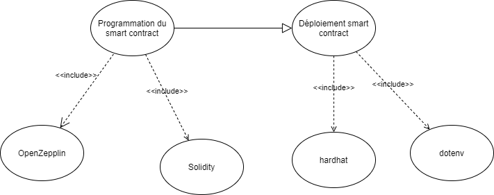
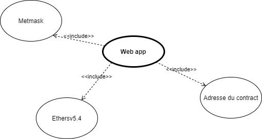
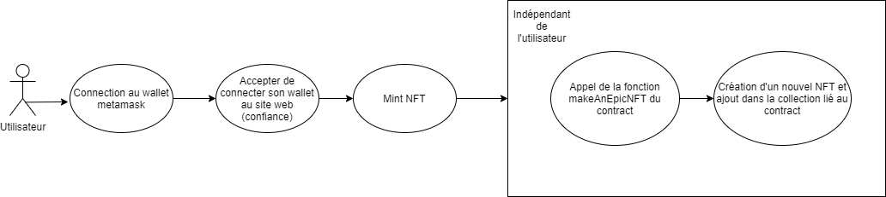

# Introduction

This project was carried out by following the tutorial proposed by buildspace.

Website : https://app.buildspace.so/

Tutorial : " Mint your own NFT collection and ship a Web3 app to show them off"

Each branch represents a step of the tutorial 

1. Create a local NFT
2. NFT on-chain
3. Use the deployed contract in web app
4. Next step

## Résultats

Web app made with replit.com : https://replit.com/@rya-sge/nft-starter-project

Link wep app : [https://nft-starter-project.rya-sge.repl.co](https://nft-starter-project.rya-sge.repl.co/)https://nft-starter-project.rya-sge.repl.co/)

Collection available on opensea : https://testnets.opensea.io/collection/flowerpower-wu5p8hwnk2


# Command

```shell
npx hardhat accounts
npx hardhat compile
npx hardhat clean
npx hardhat test
npx hardhat node
node scripts/sample-script.js
npx hardhat help
```


## Schéma


- Programmation et déploiement du smart contract



- Application web



- Application web - utilisateur



## Librairies et outils externes

### Hardhat

Environnement de développement dédié à la blockchain

 Permet de compiler rapidement des smart contract. Il est possible de les déployer sur la blockchain ou sur une blockchain local pour effectuer des tests.

Lien : [https://hardhat.org](https://hardhat.org)

### Ethereum-waffle

Permet de compiler localement des smart contract pour effectuer des tests

Lien : [https://www.npmjs.com/package/ethereum-waffle](https://www.npmjs.com/package/ethereum-waffle)

### OpenZeppelin

Utiliser pour le développement de smart contract sécurisé.

Lien : [https://openzeppelin.com](https://openzeppelin.com)

Lien documentation ERC 721 : [https://docs.openzeppelin.com/contracts/4.x/erc721](https://docs.openzeppelin.com/contracts/4.x/erc721)

Quelques fonctions : 

- [`ERC721URIStorage`](https://docs.openzeppelin.com/contracts/4.x/api/token/erc721#ERC721URIStorage) : contrat implémentant la norme ERC721 qui incluts les extensions standard de métadonnée  ([`IERC721Metadata`](https://docs.openzeppelin.com/contracts/4.x/api/token/erc721#IERC721Metadata))  
- [`_setTokenURI`](https://docs.openzeppelin.com/contracts/4.x/api/token/erc721#ERC721-_setTokenURI-uint256-string-) : permet d'enregister les métadonnées dans le NFT. 
- [`ERC721PresetMinterPauserAutoId`](https://docs.openzeppelin.com/contracts/4.x/erc721#api:presets.adoc#ERC721PresetMinterPauserAutoId). It is preset to allow for token minting (create) with token ID and URI auto generation,
- Le `tokenURI` contient le lieu où se situe les données du NFT. C'est en général liées à un fichier JSON appelé métadonnée

Exemple :

```
//Miné le NFT avec comme propriétaire l'adresse de msg.sender et l'id newItemId
_safeMint(msg.sender, newItemId);

 //Mise à jour de l'URI (métadonné du NFT)
 _setTokenURI(newItemId, finalTokenUri);

//Incrémenter l'id du NFT
_tokenIds.increment();
```


### Alchemy

Alchemy facilite le "broadcast" du contract créee permettant ce qu'il soit rapidement traité par des mineurs. Une fois la transaction miné, le contract sera alors "broadcasté" au reste du réseau.

Lien : [https://www.alchemy.com/](https://www.alchemy.com/)

### OpenSea

Plateforme permettant d'échanger des NFT.

Remarque : La plateforme suit le standard ERC721 concernant les métadonnées du NFT.

### Ethersv5.4

Cette librairie n'a pas été utilisé dans le code  du projet. Elle est utilisé côté client pour interagir avec l'utilisateur, Metamask et le contrat déployé

Lien : [ethersv5.4](https://docs.ethers.io/v5/)

Exemple :

```javascript
   const  CONTRACT_ADDRESS = "0x6Cd83F987eEEEc3a917cD80D35265a71F50E5702"

  try {
    const { ethereum } = window;

    if (ethereum) {
      const provider = new ethers.providers.Web3Provider(ethereum);
      const signer = provider.getSigner();
      const connectedContract = new ethers.Contract(CONTRACT_ADDRESS, myEpicNft.abi, signer);
      }
```

